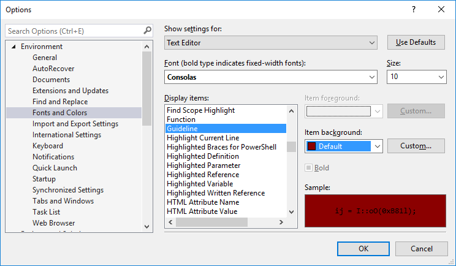

# Editor Guidelines
A Visual Studio extension that adds vertical column guides to the text editor.

The extension adds vertical column guides behind your code. This is useful if you are trying to tabulate columns of data or if you want to ensure that your lines don't extend beyond a certain length. You specify where the guides go and what color they should be.

## Getting Started
[Download](https://marketplace.visualstudio.com/items?itemName=PaulHarrington.EditorGuidelines) and run the extension (VSIX) for Visual Studio 2012 or later from the [Visual Studio Marketplace](https://marketplace.visualstudio.com/items?itemName=PaulHarrington.EditorGuidelines) or, from within Visual Studio, search for "Editor Guidelines" in the "Extensions and Updates" UI.

Control guidelines via the context (right-click) menu on the editor surface. You will see a *Guidelines* flyout with three commands:

* When *Add Guideline* is selected, a vertical dashed line will be drawn at the same position as the caret (insertion point).
* *Remove Guideline* will remove any guideline at the current insertion point.
* *Remove All Guidelines* does exactly that.

You can change the guideline color from the Fonts and Colors page in `Tools|Options`. Look for *Guideline* in the Text Editor category:

These commands may also be accessed from Visual Studio's Command Window.

Note that the column numbers used for the `Edit.AddGuideline` and `Edit.RemoveGuideline` commands refer to the right side of the given column of text.
i.e. To place a guide to the right of column 80, use `Edit.AddGuideline 80`. To place a guide to the left of the first column use `Edit.AddGuideline 0`.

_Note: This extension collects and transmits anonymized usage statistics to the extension author for product improvement purposes._
